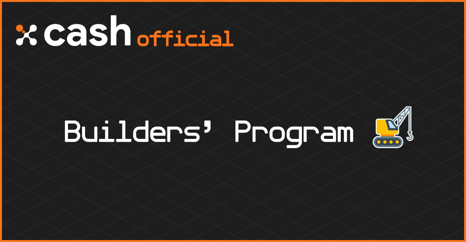

# X-Cash Builders' Program
🛠 **Hub for projects with high bounty rewards for furthering the XCASH ecosystem.**  
The builders' program is designed to enable contributors to participate in the development of XCASH and getting bounty for it.

## Table of Contents

- [Table of Contents](#table-of-contents)
- [Introduction](#introduction)
- [Proposing a project](#proposing-a-project)
- [X-Builder Project - XBP](#x-builder-project---xbp)

## Introduction

The **builders' program** enables people to participate, develop and promote the **X-Cash Foundation** through the funding of community-driven projects.

In practice, an **XBP - X-Builder Project** will follow the life cycle below:
- An **XBP** is [proposed](#proposing-a-project) and/or validated by the **X-Cash Foundation**.
- The project is listed [here](#open-for-application) and open for application (if not yet assigned).
- A member of the community apply to the project.
- The **X-Cash Foundation** core team will review all application and decide on the project assignation.

## Proposing a project

**You want to participate in improving the X-Cash Ecosystem but there are no current project that you can undertake?**  
You can create an issue on this repository using the project template [project template]() to explain your idea and how you plan to achieve your goal.

> *A project proposition that fails to follow the guidelines will not be considered by the X-Cash Foundation*

Every project proposition will be reviewed once a month. The X-Cash Foundation reserves the rights to accept or refuse a project. If the majority of the Foundation accepts the proposition, the project can move forward.

Once every part of the project (milestones, schedule, budget etc...) have been agreed upon by both parties, it will be added to the official **XBP** list below.

*All project deliberations will be made public and discussed directly under the issue.*

## X-Builder Project - XBP

### Open for application

| Name | Title | Type | Recurrence | Proposed by |
| ---- | ----- | ---- | ---------- | ----------- |

### In Process

| Name | Title | Type | Recurrence | Assigned to |
| ---- | ----- | ---- | ---------- | ----------- |

### Completed

| Name             | Title                                  | Repository                                                          | Amount | Completed by                                         |
| ---------------- | -------------------------------------- | ------------------------------------------------------------------- | ------ | ---------------------------------------------------- |
| [XBP-01](XBP-01) | Wallet Application for Android Devices | [android-wallet](https://github.com/X-Cash-official/android-wallet) | USD xxx   | [@snakewaypasser](https://github.com/snakewaypasser) |
| [XBP-02](XBP-02) | GUI Desktop Wallet in ElectronJS       | [desktop-wallet](https://github.com/X-Cash-official/android-wallet) | USD xxx   | [@mtardy](https://github.com/mtardy)                 |

